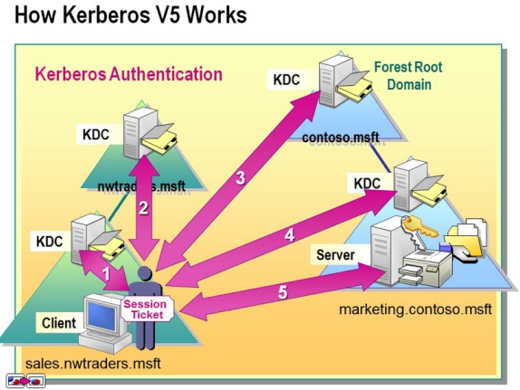
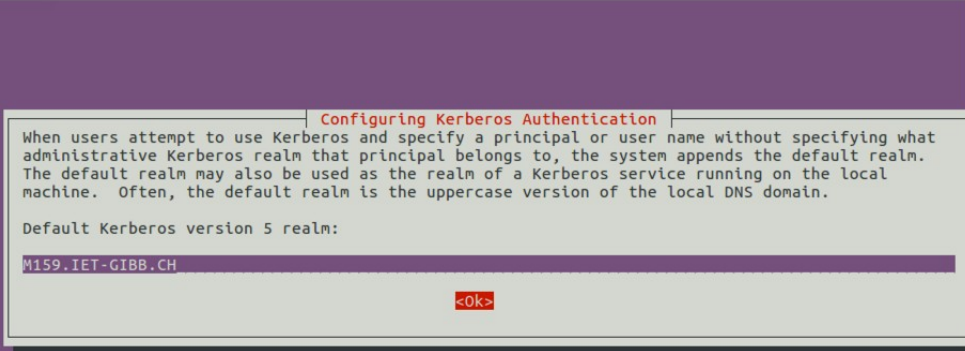
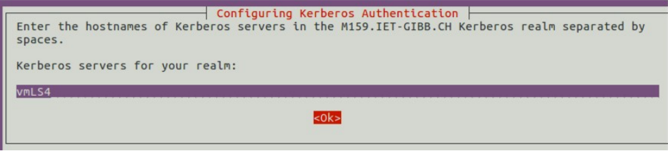
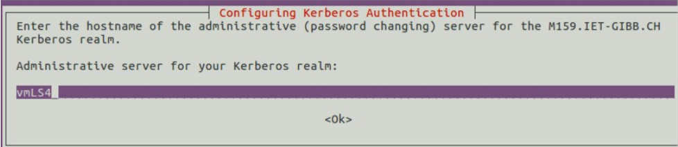
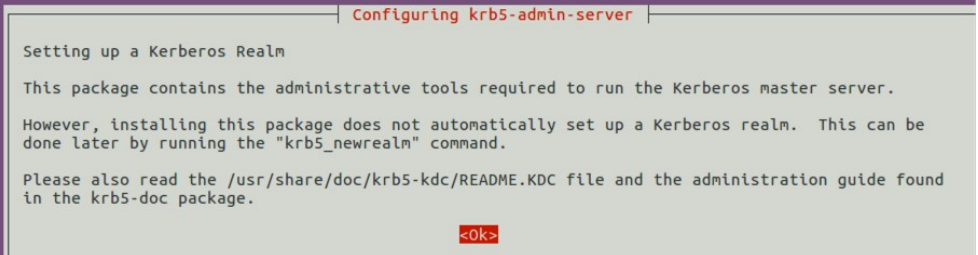

# Modul 159
## Arbeitsblatt 01
### Exceltabelle

### Was würde passieren, wenn der private Schlüssel des KDC bekannt wäre ?
1. **Falsche Identitäten:** Die Leute könnten gefälschte Tickets erstellen und sich als andere ausgeben, um auf Dinge zuzugreifen, für die sie keine Berechtigung haben.
2. **Geheimnisenthüllung:** Der Datenverkehr, der normalerweise geschützt ist, könnte entschlüsselt werden, was zu Informationsdiebstahl führen könnte.
3. **Vertrauensverlust:** Die Leute würden dem Netzwerk weniger vertrauen, weil sie nicht sicher wären, ob die Sicherheitsmechanismen noch funktionieren.
4. **Angriffe:** Die Angreifer könnten sich in den Datenverkehr einschalten und ihn manipulieren, um Schaden anzurichten.
### Warum kann der Client das TGT nicht entschlüsseln ?
Der Ticket Granting Ticket (TGT) ist verschlüsselt, um die Sicherheit zu gewährleisten. Der Client kann es nicht entschlüsseln, weil es mit dem geheimen Schlüssel des KDC verschlüsselt ist. Das macht es schwierig für Angreifer, die darin enthaltenen Informationen abzufangen oder zu ändern. Der Client nutzt das TGT, um bei anderen Diensten spezielle Tickets zu bekommen, die der Client dann entschlüsseln kann, um auf bestimmte Dinge zuzugreifen.
### Warum kann der Client das Server-Ticket nicht entschlüsseln
Der Client kann das Server-Ticket bei der Kerberos-Authentifizierung nicht entschlüsseln, da das Server-Ticket normalerweise mit dem langfristigen geheimen Schlüssel des Servers verschlüsselt ist, während der Client im Besitz seines eigenen langfristigen geheimen Schlüssels ist.
Der Client selbst kann das Server-Ticket nicht entschlüsseln, da es mit dem langfristigen geheimen Schlüssel des Servers verschlüsselt ist, zu dem der Client keinen direkten Zugriff hat. Der Client benötigt nur das Server-Ticket, um es sicher zum Server weiterzuleiten. Sobald der Server das Ticket entschlüsselt hat und den Sitzungsschlüssel extrahiert hat, können der Client und der Server verschlüsselte Kommunikation unter Verwendung dieses Sitzungsschlüssels durchführen.

### Warum kann der Client das Server-Ticket nicht entschlüsseln
Der Client kann das Server-Ticket nicht entschlüsseln, weil das Server-Ticket mit dem langfristigen geheimen Schlüssel des Servers verschlüsselt ist, und der Client diesen Schlüssel nicht besitzt. Dies ist ein grundlegendes Sicherheitsprinzip im Kerberos-Authentifizierungsprotokoll.

## Grundlagen von Kerberos


### 1 Einführung Directory Services
#### 1.1 Was ist ein Directory Service ?
Ein Verzeichnisdienst verwaltet  Computer, Benutzer, Drucker usw. und ermöglicht kontrollierten Zugriff auf diese Objekte. Administratoren behalten dank des Verzeichnisdienstes den Überblick über diese Objekte. Authentifizierung und Identifizierung der Benutzer im Netzwerk werden über Benutzernamen und Passwörter realisiert.

Ein Verzeichnisdienst ist eine Datenbank. Produkte wie Microsofts Active Directory Domain Services (ADDS) nutzen diesen Standard. Der Zugriff auf die Objekte erfolgt über das Lightweight Directory Access Protocol (LDAP). Kerberos V5 ist ein wichtiges Protokoll, das bei der Authentifizierung eine zentrale Rolle spielt. Es gewährleistet, dass Benutzer und Server keine falsche Identität vortäuschen können.
#### 1.2 Wie gehen wir weiter ? 
Verzeichnisdienste basieren und einem Authentisierungsdienst (Authentisierungsprotokoll): Kerberos.  Was ist mit „nativ“ gemeint? Wir verwenden Kerberos V5 in seiner Standardform, wie sie vom MIT (Massachusetts Institute of Technology, Boston) entwickelt wurde. Diese wurde der Allgemeinheit zur Verfügung gestellt und ist im Internet-Standard RFC 4120 spezifiziert. Das MIT nennt dieses KRB5. Neben dem MIT-Kerberos-Standard, welcher weltweit am meisten genutzt wird, existiert auch eine Implementierung, welche sich Heimdahl nennt. Diese wurde von einer schwedischen Universität (KTH) entwickelt und basiert nicht auf den Quellen vom MIT. Heimdahl stellt also die europäische Version des Kerberos Standards dar. Dies kommt daher, weil in den USA kryptografische Software strengen Exportbeschränkungen unterlagen. 
### 2 Grundlagen der Netzwerkauthentisierung mit Kerberos
Kerberos ist ein Authentisierungsdienst bzw. ein Authentisierungsprotokoll. Unter **Authentisierung** versteht man den Nachweis der eigenen Identitiät. Wird eine Identität überprüft spricht man von einer **Authentifizierung**. 
#### 2.1 Netzwerkdienste und Netzwerkprotokolle
Hier sind einige Netzwerkdienste und ihre Netzwerkprotokolle aufgelistet:

| Netzwerkdienst             | Netzwerkprotokoll |
| -------------------------- | ----------------- |
| Webserver                  | HTTP              |
| E-Mail-Dienst              | SMTP, POP3, IMAP  |
| Dateidienst                | CIFS, NFS, AFS    |
| Druckdienst                | IPP               |
| Verzeichnisdienst          | LDAP              |
| Host (interaktive Nutzung) | SSH, RSH, Telnet  | 

#### 2.3 Kerberos - Begriffe
##### 2.3.1 KDC
Für die Kerberos-Authentisierung wird ein dritter Teilnehmer benötigt, der Kerberos Dienst. Dieser wird als Key Distribution Center (KDC) bezeichnet. Damit Kerberos funktioniert müssen alle Clients und Dienste ein Trust zu ihrem KDC haben. Deshalb wird der KDC auch als Trusted Third Party bezeichnet. 
##### 2.3.2 Realm
Ein Realm ist eine Kerberos-Umgebung. Jeder User oder Client sowie jeder Dienst oder Host gehören zu einem Kerberos Realm. 
##### 2.3.3 Principals
Clients und Dienste in einem Realm werden durch **Kerberos Principals** repräsentiert. 

### Aufbau einer eigenen Kerberos Infrastruktur
#### OS-Updaten
Die VMs **vmLS1** und **vmLP1** müssen aktualisiert werden. Da es sich um Ubuntu-Server handelt, sollte man apt verwenden:
```Bash
sudo apt update -y
sudo apt upgrade -y
```
#### Netzwerkkonfiguration
##### vmLS4
Die Netzwerkkonfiguration für vmLS1 sollte in diesem File angepasst werden: `/etc/netplan/00-eth0.yaml`
```/etc/netplan/00-eth0.yaml
network:
 ethernets:
 eth0:
 addresses:
 - 192.168.210.64/24
 nameservers:
 addresses:
 - 192.168.210.1
 search:
 - m159.iet-gibb.ch
 routes:
 - to: default
 via: 192.168.210.1
 version: 2
```
Der netplan kann mit:
```Bash
sudo netplan apply 
```
verwendet werden. 
### Key Distribution Center von MIT Kerberos
Der FQDN des Linux-Servers vmLS1 lautet: **vmLS4.m159.iet-gibb.ch**. 
#### Installation von Kerberos auf vmLS1
Install command:
```Bash
apt install krb5-user krb5-doc krb5-kdc krb5-admin-server krb5-kdc-ldap
```




#### Konfiguration des KDC
Die Konfiguration des KDC sollte von Grund auf durchgeführt werden. Deshalb sollte zunächst die Konfigurationsvorlagen gelöscht werden. Diese befinden sich unter `/etc/krb5kdc/kdc.conf` und `/etc/krb5.conf`.
Die brereits gestarteten Deamons können so gestoppt werden:
```Bash
systemctl stop krb5-kdc systemctl stop krb5-admin-server mv /etc/krb5kdc/kdc.conf /etc/krb5kdc/kdc.conf.BACKUP mv /etc/krb5.conf /etc/krb5.conf.BACKUP
```
Nun sollte die Konfiguration für den KDC angelegt werden (`/etc/krbr5kdc/kdc.conf`)
```kdc.conf
[libdefaults]
 default_realm = M159.IET-GIBB.CH
[kdcdefaults]
 kdc_ports = 750,88
[realms]
 M159.IET-GIBB.CH = {
 database_name = /var/lib/krb5kdc/principal
 admin_keytab = FILE:/etc/krb5kdc/kadm5.keytab
 acl_file = /etc/krb5kdc/kadm5.acl
 key_stash_file = /etc/krb5kdc/stash
 kdc_ports = 750,88
 max_life = 10h 0m 0s
 max_renewable_life = 7d 0h 0m 0s
  master_key_type = des3-hmac-sha1
 #supported_enctypes = aes256-cts:normal aes128-cts:normal
 default_principal_flags = +preauth
 }
[logging]
 kdc = SYSLOG:INFO:AUTH
 admin_server = SYSLOG:INFO:AUTH
 ```
##### Initialisierung der KDC-Datenbank
Bevor das KDC gestartet wird, müssen noch **Principals** angelegt werden. 