# Zu beachten
- Gateway und DNS bei allen Rechnern: 192.168.110.2. Korrigieren bei vmLP1, vmLS1 und vmLS2
- Rechnernamen (FQDN):
  vmLS1.sam159.iet-gibb.ch
- Search Doamin im netplan-yaml: sam159.iet-gibb.ch
Arbeitsblatt 3
- Update und Upgrade sollte unbedingt ausgeführt werden. 
# Arbeitsblatt 1
## Lernziele
- Verwaltung eines ADDS mit Samba
- Praktisches Fallbeispiel ist die Basis für eine realitätsnahe Konfiguration
- Verständnis für LDAP
- Kenntnis, wie Windows und Linux Clients in einer Domain eingebunden werden
- Berechtigungen definieren und in einer Domain umsetzten. 
## 2 Arbeitsumgebung
In diesem Auftrag verwenden wir SAMBA. Ab der Version 4.X kann SAMBA als Implementierung des Microsoft ADDS unter Linux verstanden werden. SAMBA ist daher eine echte Alternative zum Microsoft Server. SAMBA wird auch häufig kommerziell für NAS verwendet. 
### Samba als Domain Controller:
- Ab Version 4 kann Samba als ADDC eingesetzt werden
- LDAP als AD backend ist integriert
- Heimdahl Kerberos wird vom KDC für die Authentisierung verwendet. 
### Samba als Domain Member:
- Stellt File- und Printservices zur Verfügung
- Domain Users werden gegenüber dem DC bem Login authentifiziert. 
### Laborumgebung mit Smartlearn
Die Laborumgebung besteht aus dem Realm: **SAM159.IET-GIBB.ch**. 
Folgende VM's werden dafür verwendet:
- vmLS1 --> Domain Controller / KDC, DNS Server, LDAP-Server
- vmLS2 --> Domain Member Server
- vmLP1 --> Domain Member Client
## Vorbereitung des Domain Controllers / KDC
### Samba Doamin Controller vmLS1 installieren
#### 1. Netzwerk konfigurieren
##### Netplan
```Bash
network:
  ethernets:
    eth0:
      addresses:
      - 192.168.110.61/24
      nameservers:
        addresses:
        - 192.168.110.2
        search:
        - sam159.iet-gibb.ch
      routes:
      - to: default
        via: 192.168.110.2
  version: 2
```
#### 2. Rechner Updaten
```Bash
sudo apt update && sudo apt upgrade
```
#### 3. Samba installieren
##### Diverse Packages installieren
Die packete können so installiert werden:
_Zuerst muss dies installiert werden:_
```Bash
apt install samba smbclient heimdal-clients
```
_Danach:_
```Bash
apt install acl attr build-essential libacl1-dev libattr1-dev
apt install libblkid-dev libgnutls28-dev libreadline-dev python-dev
apt install python-dnspython gdb pkg-config libpopt-dev libldap2-dev
apt install libbsd-dev attr krb5-user docbook-xsl libcups2-dev acl ntp ntpdate
apt install net-tools git winbind libpam0g-dev dnsutils lsof
```
##### Original Samba Config sichern
Würde man dies nicht ändern, so würde Samba als normaler Fileserver und nicht als KDC gestartet werden. 
```Bash
mv /etc/samba/smb.conf /etc/samba/smb.conf.orig
```
##### Samba KDC Setup
```Bash
samba-tool domain provision
```
Nachdem der Command abgesetzt wurde, wird man vom Programm abgefragt. Hier sollte folgendes angegeben werden:
Realm: **SAM159.IET-GIBB.CH**
Domain: **SAM159**
Server Role: **dc**
DNS backend: **SAMBA_INTERNAL**
DNS forwarder IP: **8.8.8.8**
Administrator password: __SmL12345**__

Wurde alles Korrekt konfiguriert, so sollte der Output in etwa so aussehen:

##### DNS-Resolver 
Da der DNS jetz von Samba zur Verfügung gestellt wird, muss der DNS-Resolver deaktiviert werden:
```Bash
sudo systemctl disable systemd-resolved
sudo systemctl stop systemd-resolved
rm /etc/resolv.conf
```
Nun muss noch ein neues file unter `/etc/resolv.conf` erstellt werden. Der Inhalt dieses Files sollte in etwa so aussehen:
```config
nameserver 192.168.110.61
search sam159.iet-gibb.ch
```
##### Neues /etc/resolv.conf erstellen
```Bash
# Global parameters
[global]
	dns forwarder = 8.8.8.8
	netbios name = VMLS1
	realm = SAM159.IET-GIBB.CH
	server role = active directory domain controller
	workgroup = SAM159
[sysvol]
	path = /var/lib/samba/sysvol
	read only = No
[netlogon]
	path = /var/lib/samba/sysvol/sam159.iet-gibb.ch/scripts
	read only = No
```
##### Samba automatisch starten
```Bash
systemctl unmask samba-ad-dc  
systemctl enable samba-ad-dc  
systemctl start samba-ad-dc  
```
Nun muss der Server noch neu gestartet werden. Danach kann mit `systemctl status` getestet werden ob es geklappt hat:
```Bash
reboot  
systemctl status samba-ad-dc
```
Der Output sollte so aussehen:

##### krb5.conf löschen
```Bash
sudo rm /etc/krb5.conf
```
##### neue krb5.conf erstellen
Datei erstellen:
```Bash
sudo nvim /etc/krb5.conf
```
Inhalt:
```conf
[libdefaults]
	default_realm = SAM159.IET-GIBB.CH
	fcc-mit-ticketflags = true
[realms]
	SAM159.IET-GIBB.CH = {
		kdc = vmLS1.sam159.iet-gibb.ch
		admin_server = vmLS1.sam159.iet-gibb.ch
}
[ domain_realm ]
	.sam159.iet-gibb.ch = SAM159.IET-GIBB.CH
	sam159.iet-gibb.ch = SAM159.IET-GIBB.CH
```
#### Netzwerk testen
##### DNS-Server von vmLS1 anzeigen lassen
```Bash
systemctl enable systemd-resolved
systemctl start systemd-resolved
systemctl status systemd-resolved
resolvectl status
```

##### Resolver-Service ausschalten
Dach dem der DNS-Server angezeigt wurde, muss der Resolver-Service wieder ausgeschaltet werden.
```Bash
systemctl stop systemd-resolved
systemctl disable systemd-resolved
```
Danach muss das System neu gestartet werden. 
```Bash
reboot
```
##### Aktive Ports anzeigen lassen
```Bash
netstat -tlpn
```

##### Internen DNS aktualisieren
```Bash
samba_dnsupdate --verbose
```
##### DNS testen

| Test                                            | Ergebnis                                                                              |
| ----------------------------------------------- | ------------------------------------------------------------------------------------- |
| `host -t SRV _kerberos._tcp.sam159.iet-gibb.ch` | `_kerberos._tcp.sam159.iet-gibb.ch has SRV record 0 100 88 vmls1.sam159.iet-gibb.ch.` |
| `host -t SRV _gc._tcp.sam159.iet-gibb.ch`       | `_gc._tcp.sam159.iet-gibb.ch has SRV record 0 100 3268 vmls1.sam159.iet-gibb.ch.`     |
| `host -t SRV _ldap._tcp.sam159.iet-gibb.ch`     | `_ldap._tcp.sam159.iet-gibb.ch has SRV record 0 100 389 vmls1.sam159.iet-gibb.ch.`    |
| `host -t A vmls1.sam159.iet-gibb.ch`            | `vmls1.sam159.iet-gibb.ch has address 192.168.110.61`                                                  | 

#### Reverse-Lookup-Zone einrichten
##### Zone einrichten
```Bash
samba-tool dns zonecreate vmLS1 110.168.192.in-addr.arpa -Uadministrator
```
Danach wird man nach dem Passwort gefragt. In meinem Fall ist dies: **Sml12345**
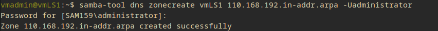
##### Zone für vmLS1 eintragen
```Bash
samba-tool dns add 192.168.110.61 110.168.192.in-addr.arpa 61 PTR vmls1.sam159.iet-gibb.ch -Uadministrator
```
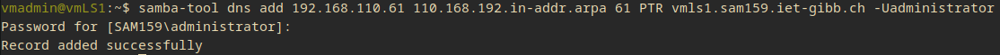
####  A- und PTR-Records eintragen
##### A-Record für vmls2
```Bash
samba-tool dns add vmLS1.sam159.iet-gibb.ch sam159.iet-gibb.ch vmLS2 A 192.168.110.62 -U administrator
```
##### A-Record für vmlp1
```Bash
samba-tool dns add vmLS1.sam159.iet-gibb.ch sam159.iet-gibb.ch vmLP1 A 192.168.110.30 -U administrator
```
##### Pointer-Record in Reverse-Zone für vmlp1
```Bash
samba-tool dns add vmLS1.sam159.iet-gibb.ch 110.168.192.in-addr.arpa 30 PTR vmLP1.sam159.iet -U administrator
```
##### Pointer-Record in Reverse-Zone für vmls2
```Bash
samba-tool dns add vmLS1.sam159.iet-gibb.ch 110.168.192.in-addr.arpa 62 PTR vmLS2.sam159.iet -U administrator
```
#### Testen der Verbindung
- ping vmLP1
- ping vmLS2
- ping vmls1
- smbclient
- reverselookup

#### Aufgaben
##### Portnummern

| Port | Verwendung |
| ---- | ---------- |
| 445  | 804/smbd   |
| 389  | 811/samba  |
| 636  | 811/samba  |
| 88   | 818/samba  |
| 53   | 842/samba  | 
##### Ticket für Admin lösen
```Bash
kinit administrator
```
Danach muss noch das Passwort des Admins eingegeben werden (__Sml12345**__)
##### Verbindung testen
```Bash
smbclient -N --use-kerberos required -L vmLS1
```
##### Wie sieht die Credential Cache aus
Der Credential Cache kann mit `klist` ausgegeben werden. 
```
Ticket cache: FILE:/tmp/krb5cc_1000
Default principal: administrator@SAM159.IET-GIBB.CH

Valid starting       Expires              Service principal
09/13/2023 11:35:13  09/13/2023 21:35:13  krbtgt/SAM159.IET-GIBB.CH@SAM159.IET-GIBB.CH
	renew until 09/14/2023 11:34:57
```
##### Warum funktioniert der Verbindungsaufbau mit localhost nicht
`smbclient -L localhost -k` funktioniert nicht, da localhost kein Kerberos Principal ist. Siehe Fehlermeldung:
```
WARNING: The option -k|--kerberos is deprecated!
Kerberos auth with 'administrator@SAM159.IET-GIBB.CH' (SAM159\vmadmin) to access 'localhost' not possible
session setup failed: NT_STATUS_ACCESS_DENIED
```
##### Passwort-Komplexität deaktivieren
```Bash
samba-tool domain passwordsettings set --complexity=off
samba-tool domain passwordsettings set --history-lengt=0
samba-tool domain passwordsettings set --min-pwd-age=0
samba-tool domain passwordsettings set --max-pwd-age=0
samba-tool user setexpiry administrator --noexpiry
```
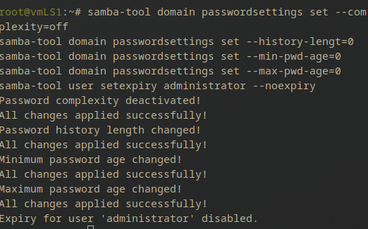
##### A Records mit samba-tool hinzufügen
```bash
samba-tool dns add vmls1.sam159.iet-gibb.ch sam159.iet-gibb.ch vmls2 A 192.168.220.11 -Uadministrator
samba-tool dns add vmls1.sam159.iet-gibb.ch sam159.iet-gibb.ch vmlp1 A 192.168.210.30 -Uadministrator
```
##### PTR Records hinzufügen
```Bash
samba-tool dns add vmls1.sam159.iet-gibb.ch 220.168.192.in-addr.arpa vmls2 PTR 11 -Uadministrator
```
##### Was zeigt samba-tool fsmo show
```
SchemaMasterRole owner: CN=NTDS Settings,CN=VMLS1,CN=Servers,CN=Default-First-Site-Name,CN=Sites,CN=Configuration,DC=sam159,DC=iet-gibb,DC=ch
InfrastructureMasterRole owner: CN=NTDS Settings,CN=VMLS1,CN=Servers,CN=Default-First-Site-Name,CN=Sites,CN=Configuration,DC=sam159,DC=iet-gibb,DC=ch
RidAllocationMasterRole owner: CN=NTDS Settings,CN=VMLS1,CN=Servers,CN=Default-First-Site-Name,CN=Sites,CN=Configuration,DC=sam159,DC=iet-gibb,DC=ch
PdcEmulationMasterRole owner: CN=NTDS Settings,CN=VMLS1,CN=Servers,CN=Default-First-Site-Name,CN=Sites,CN=Configuration,DC=sam159,DC=iet-gibb,DC=ch
DomainNamingMasterRole owner: CN=NTDS Settings,CN=VMLS1,CN=Servers,CN=Default-First-Site-Name,CN=Sites,CN=Configuration,DC=sam159,DC=iet-gibb,DC=ch
DomainDnsZonesMasterRole owner: CN=NTDS Settings,CN=VMLS1,CN=Servers,CN=Default-First-Site-Name,CN=Sites,CN=Configuration,DC=sam159,DC=iet-gibb,DC=ch
ForestDnsZonesMasterRole owner: CN=NTDS Settings,CN=VMLS1,CN=Servers,CN=Default-First-Site-Name,CN=Sites,CN=Configuration,DC=sam159,DC=iet-gibb,DC=ch
```
# Arbeitsblatt 2
## Lernziele
- Installation und Konfiguration des LDAP Access Managers (LAM)
- Übersicht der Objekte eines AD mit der LDAP-Brille
- Anlegen eines Users und Hinzufügen in eine Gruppe
- TGT für neu erstellten User beziehen und Testverbindung herstellen
## Installation und Konfiguration LAM
Um den LDAP-Dienst zu testen müssen die ldap-tools und der LAM (LDAP-Account-Manager) noch installiert werden.
```Bash
sudo apt-get install smbldap-tools
sudo apt install ldap-account-manager
```
Mit dem Browser auf den LAM verbinden: http://100.114.67.130/lam/.
### Default Profil erstellen
Um ein neues Profil zu erstellen muss man recht oben auf `LAM configuration` klicken.
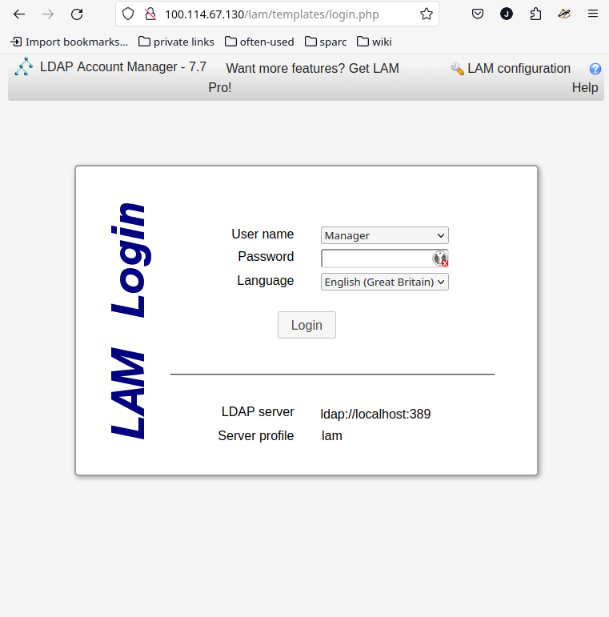
Hier kann man `Edit server profiles` --> `Manage server profiles` auswählen. Nun muss kann man das neue Profil konfigurieren. 
Das neue Profil hat folgende Angaben:
- Profile name: sam159Domain
- ProfilePassword: SmL12345**
- Template: windows_samba4
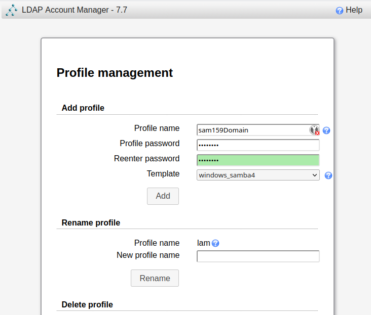
Danach wird man noch nach dem Master password gefragt. Das Master Passwort ist **lam**.
### LAM-General Settings definieren
Folgendes muss eingestellt werden:
- Server address: ldap://vmls1.sam159.iet-gibb.ch
- Tree suffix: **dc=sam159,dc=iet-gibb,dc=ch**
- Default Language: **Deutsch**
- Time zone: **Europe/Zurich**
- List of valid user: **cn=Administrator,cn=users,dc=sam159,dc=iet-gibb,dc=ch**
### LAM-Account Types definieren
Unter `Account types` --> `Users`, `Groups` und `Hosts` jeweils den LDAP suffix "**dc=sam159,dc=iet-gibb,dc=ch**" und unter `Module settings`:  `Windows`-->`Domains`: **sam159.iet-gibb.ch**.
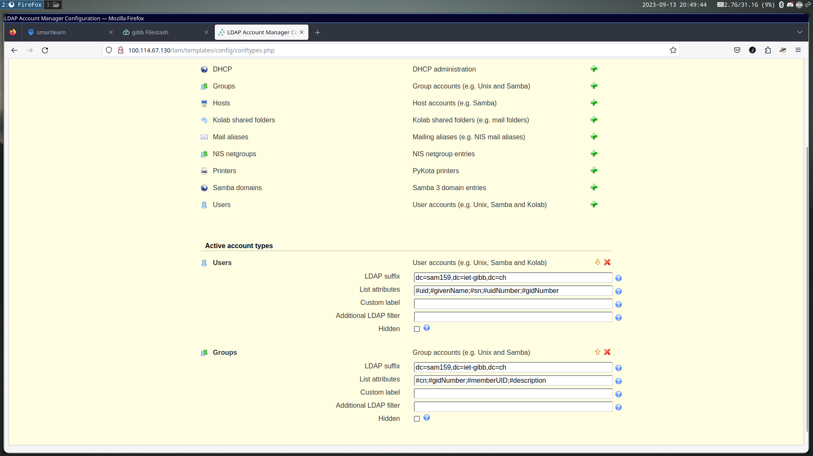
Bevor man sich jetzt anmelden kann, muss man noch den nächsten Schritt ausführen.
#### $\text{\color{red}{\Huge  Wichtig!}}$ 
Damit die Verbindung funktioniert, muss in der `smb.conf` noch etwas angepasst werden.
```Bash
sudo nvim /etc/samba/smb.conf
```
Das File sollte dann in etwa so aussehen:
```Bash
# Global parameters
[global]
        dns forwarder = 8.8.8.8
        netbios name = VMLS1
        realm = SAM159.IET-GIBB.CH
        server role = active directory domain controller
        workgroup = SAM159
        ldap server require strong auth = no

[sysvol]
        path = /var/lib/samba/sysvol
        read only = No

[netlogon]
        path = /var/lib/samba/sysvol/sam159.iet-gibb.ch/scripts
        read only = No
```
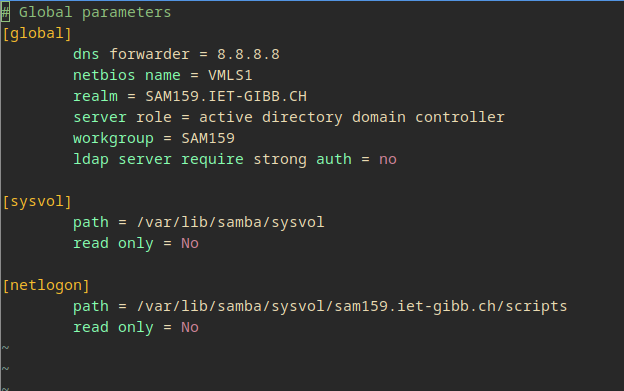
Danach kann man sich anmelden.
### LAM Administrator Login
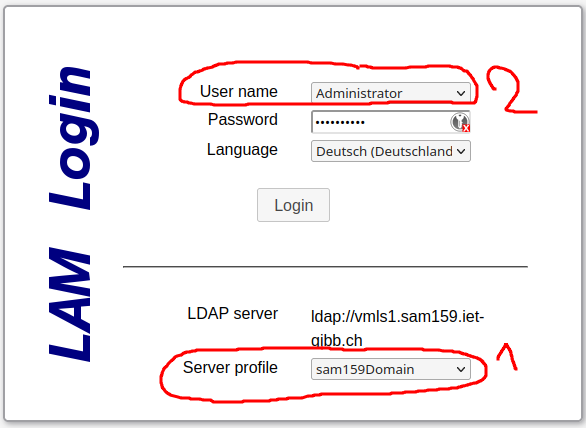
Bei mir war das Server profile nicht auf **sam159Domain** gestellt, was ich noch ändern musste. Danach musste ich beim **Username Dropdown** noch den **Administrator** Account auswählen. Das Passwort ist auch hier __SmL12345**__. 
Nun sollte die Webseite so aussehen:
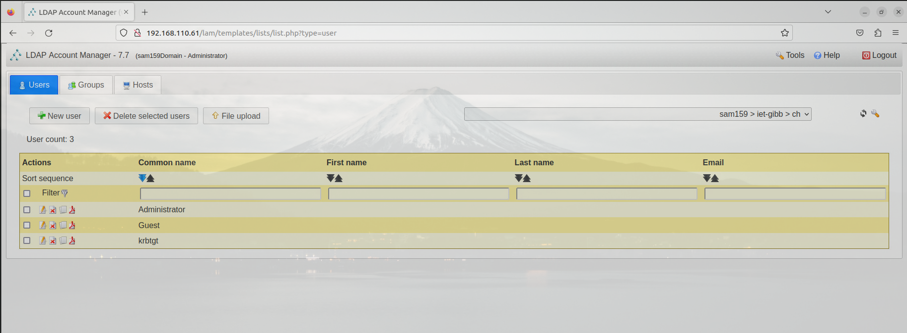
#### Tree View
Um alle Objekte des AD zu sehen kann die Tree View verwendet werden. Dies ist unter `Tools` -->`Tree View` zu finden und ist nicht mehr im Dashboard. (AB02 veraltet).

## Aufgaben
### Neuen User im LDAP anlegen + TGT lösen
#### Benutzer anlegen
Um einen neuen User anzulegen, kann man im Dashboard einfach auf " + NEW User" klicken. Nun kann man alles nötige eintragen:
User name: Jamie
Password: SmL12345**
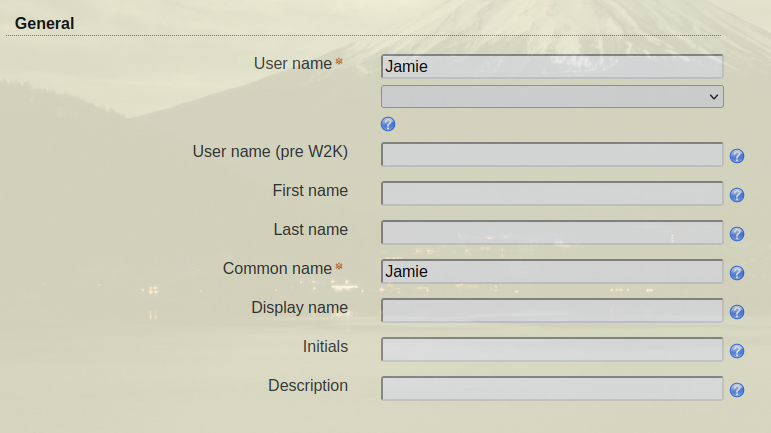
#### Benutzer der Admin Gruppe hinzufügen
Dazu kann unter dem Tab `Groups` die Gruppe `Domain Admins` ausgewählt werden. In den Goupsettings kann nun unter `Goup members` --> `Edit`-->`Users`-->`Ok`-->`Jamie` -->`Add`. Nun sollte man unter `Group members` folgende Einträge sehen:
```
Jamie > sam159 > iet-gibb > ch
Administrator > Users > sam159 > iet-gibb > ch
```
#### Wie lautet der _destinguishedName_ des Benutzers
Mann kann den DN des Users in der **Tree View** anzeigen lassen. Da es sich um ein AD-Objekt handelt, kann man den User hier finden. Wenn man auf den User klickt, und auf search klickt, sieht man recht einiges eingeblendet. Unter andrem sieht man hier auch den DN. Der DN meines Jamie Users lautet: `CN=Jamie,DC=sam159,DC=iet-gibb,DC=ch` 
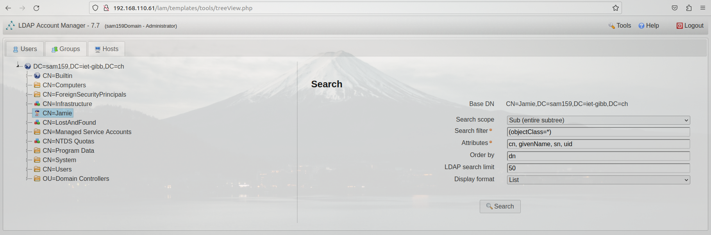
#### Wie lautet der _destinguishedName_ der Gruppe **Domain Admins** 
Wie schon bei dem User ist die Gruppe unter **Tree View** zu finden. Jedoch ist sie etwas versteckt. Die Gruppe ist unter `CN=Users` --> `CN=Domain Admins` zu finden. Der DN lautet hier: `CN=Domain Admins,CN=Users,DC=sam159,DC=iet-gibb,DC=ch`
#### Ein TGT für den User lösen


