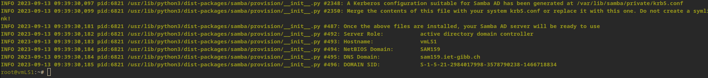

# Zu beachten
- Gateway und DNS bei allen Rechnern: 192.168.110.2. Korrigieren bei vmLP1, vmLS1 und vmLS2
- Rechnernamen (FQDN):
  vmLS1.sam159.iet-gibb.ch
- Search Doamin im netplan-yaml: sam159.iet-gibb.ch
Arbeitsblatt 3
- Update und Upgrade sollte unbedingt ausgeführt werden. 
# Mein Setup
Ich habe Tailscale auf meinem Client, sowie auf dem vmLP1 installiert. Somit muss ich VMWareworkstation nicht mehr verwenden. 
# Arbeitsblatt 1
## Lernziele
- Verwaltung eines ADDS mit Samba
- Praktisches Fallbeispiel ist die Basis für eine realitätsnahe Konfiguration
- Verständnis für LDAP
- Kenntnis, wie Windows und Linux Clients in einer Domain eingebunden werden
- Berechtigungen definieren und in einer Domain umsetzten. 
## 2 Arbeitsumgebung
In diesem Auftrag verwenden wir SAMBA. Ab der Version 4.X kann SAMBA als Implementierung des Microsoft ADDS unter Linux verstanden werden. SAMBA ist daher eine echte Alternative zum Microsoft Server. SAMBA wird auch häufig kommerziell für NAS verwendet. 
### Samba als Domain Controller:
- Ab Version 4 kann Samba als ADDC eingesetzt werden
- LDAP als AD backend ist integriert
- Heimdahl Kerberos wird vom KDC für die Authentisierung verwendet. 
### Samba als Domain Member:
- Stellt File- und Printservices zur Verfügung
- Domain Users werden gegenüber dem DC bem Login authentifiziert. 
### Laborumgebung mit Smartlearn
Die Laborumgebung besteht aus dem Realm: **SAM159.IET-GIBB.ch**. 
Folgende VM's werden dafür verwendet:
- vmLS1 --> Domain Controller / KDC, DNS Server, LDAP-Server
- vmLS2 --> Domain Member Server
- vmLP1 --> Domain Member Client
## Vorbereitung des Domain Controllers / KDC
### Samba Doamin Controller vmLS1 installieren
#### 1. Netzwerk konfigurieren
Dieser ganze Punkt kann übersprungen werden, da SmartLearn online verwendet wird. 
#### 2. Rechner Updaten
```Bash
sudo apt update && sudo apt upgrade
```
#### 3. Samba installieren
##### Diverse Packages installieren
Die packete können so installiert werden:
_Zuerst muss dies installiert werden:_
```Bash
apt install samba smbclient heimdal-clients
```
_Danach:_
```Bash
apt install acl attr build-essential libacl1-dev libattr1-dev
apt install libblkid-dev libgnutls28-dev libreadline-dev python-dev
apt install python-dnspython gdb pkg-config libpopt-dev libldap2-dev
apt install libbsd-dev attr krb5-user docbook-xsl libcups2-dev acl ntp ntpdate
apt install net-tools git winbind libpam0g-dev dnsutils lsof
```
##### Original Samba Config sichern
Würde man dies nicht ändern, so würde Samba als normaler Fileserver und nicht als KDC gestartet werden. 
```Bash
mv /etc/samba/smb.conf /etc/samba/smb.conf.orig
```
##### Samba KDC Setup
```Bash
samba-tool domain provision
```
Nachdem der Command abgesetzt wurde, wird man vom Programm abgefragt. Hier sollte folgendes angegeben werden:
Realm: **SAM159.IET-GIBB.CH**
Domain: **SAM159**
Server Role: **dc**
DNS backend: **SAMBA_INTERNAL**
DNS forwarder IP: **8.8.8.8**
Administrator password: __SmL12345**__

Wurde alles Korrekt konfiguriert, so sollte der Output in etwa so aussehen:

##### DNS-Resolver 
Da der DNS jetz von Samba zur Verfügung gestellt wird, muss der DNS-Resolver deaktiviert werden:
```Bash
sudo systemctl disable systemd-resolved
sudo systemctl stop systemd-resolved
rm /etc/resolv.conf
```
##### Neues /etc/resolv.conf erstellen
```Bash
# Global parameters
[global]
	dns forwarder = 8.8.8.8
	netbios name = VMLS1
	realm = SAM159.IET-GIBB.CH
	server role = active directory domain controller
	workgroup = SAM159
[sysvol]
	path = /var/lib/samba/sysvol
	read only = No
[netlogon]
	path = /var/lib/samba/sysvol/sam159.iet-gibb.ch/scripts
	read only = No
```
##### Samba automatisch starten
```Bash
systemctl unmask samba-ad-dc  
systemctl enable samba-ad-dc  
systemctl start samba-ad-dc  
```
Nun muss der Server noch neu gestartet werden. Danach kann mit `systemctl status` getestet werden ob es geklappt hat:
```Bash
reboot  
systemctl status samba-ad-dc
```
Der Output sollte so aussehen:

##### krb5.conf löschen
```Bash
sudo rm /etc/krb5.conf
```
##### neue krb5.conf erstellen
Datei erstellen:
```Bash
sudo nvim /etc/krb5.conf
```
Inhalt:
```conf
[libdefaults]
	default_realm = SAM159.IET-GIBB.CH
	fcc-mit-ticketflags = true
[realms]
	SAM159.IET-GIBB.CH = {
		kdc = vmLS1.sam159.iet-gibb.ch
		admin_server = vmLS1.sam159.iet-gibb.ch
}
[ domain_realm ]
	.sam159.iet-gibb.ch = SAM159.IET-GIBB.CH
	sam159.iet-gibb.ch = SAM159.IET-GIBB.CH
```
#### Netzwerk testen
##### DNS-Server von vmLS1 anzeigen lassen
```Bash
systemctl enable systemd-resolved
systemctl start systemd-resolved
systemctl status systemd-resolved
resolvectl status
```

##### Resolver-Service ausschalten
Dach dem der DNS-Server angezeigt wurde, muss der Resolver-Service wieder ausgeschaltet werden.
```Bash
systemctl stop systemd-resolved
systemctl disable systemd-resolved
```
Danach muss das System neu gestartet werden. 
```Bash
reboot
```
##### Aktive Ports anzeigen lassen

